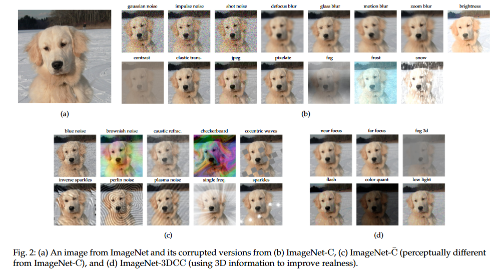

# Benchmark Suite for Evaluating Corruption Robustness of Computer Vision Models
## Introduction
### This is the benchmark framework used in the survey paper [The Robustness of Computer Vision Models against Common Corruptions: a Survey](https://arxiv.org/abs/2305.06024). It evaluates the corruption robustness of ImageNet-trained classifiers to benchmark datasets: [ImageNet-C](https://github.com/hendrycks/robustness), [ImageNet-C-bar](https://github.com/facebookresearch/augmentation-corruption), [ImageNet-P](https://github.com/hendrycks/robustness), [ImageNet-3DCC](https://github.com/EPFL-VILAB/3DCommonCorruptions).


<p align="center"></p>
  
 ---
 ### Quick start
 Before running:
 
  * Download the datasets  
  * Install libraries neccesary to load the model (e.g., folders *backbone* and *blocks*)
  * Other libraries to install 
   ```
   pip install -r requirements.txt
   ```
  
  
 Using your customize models:
 ``` 
 python main.py --ckpt model_path.ckpt --ckpt_baseline baseline_path.ckpt --dataset cifar > summary.out
 ```
 
 or using pre-trained models from timm
 
 ``` 
 python main.py --model resnet18  --dataset ImageNet_C_bar --image_size 224 --data_path /whereYouStoreImageNet_C_bar/  > summary.out
 ```
 ---
 Notice: 
 * It is important to define the file name 'summary.out', because it saves the printed results of the datasets (e.g. mCE, mFP, ......).
 *  Change this parameter to select the pretrained model  '--model'
 * Copy datasets first, e.g. 
 ``` 
 cp -r /deepstore/datasets/dmb/ComputerVision/nis-data/shunxin/ImageNet_P/  /local/swang/
 ```
 ---
 
 For testing on all benchmark datasets, it has high requirement of storage. Thus, we suggest testing on benchmark datasets one by one. 


  - metric.py
    - Accuracy (per corruption per severity) [For ImageNet - ALL]
    - Corruption Error (CE) [For ImageNet-C/-C-bar/-3DCC]
    - mCE [For ImageNet-C/-C-bar/-3DCC]
    - mFP [For ImageNet-P]
    - mT5D [For ImageNet-P]
    - Relative robustness [For ImageNet - ALL]
    - Expected callibration error (ECE) [For ImageNet - ALL]
  - test.py
    - load a dataset
    - output test results
  - main.py
    - load a model (+ a baseline model)
    - test a model on all datasets
    - output a summary of test results
  - notebook
    - plot results based on summary
 
